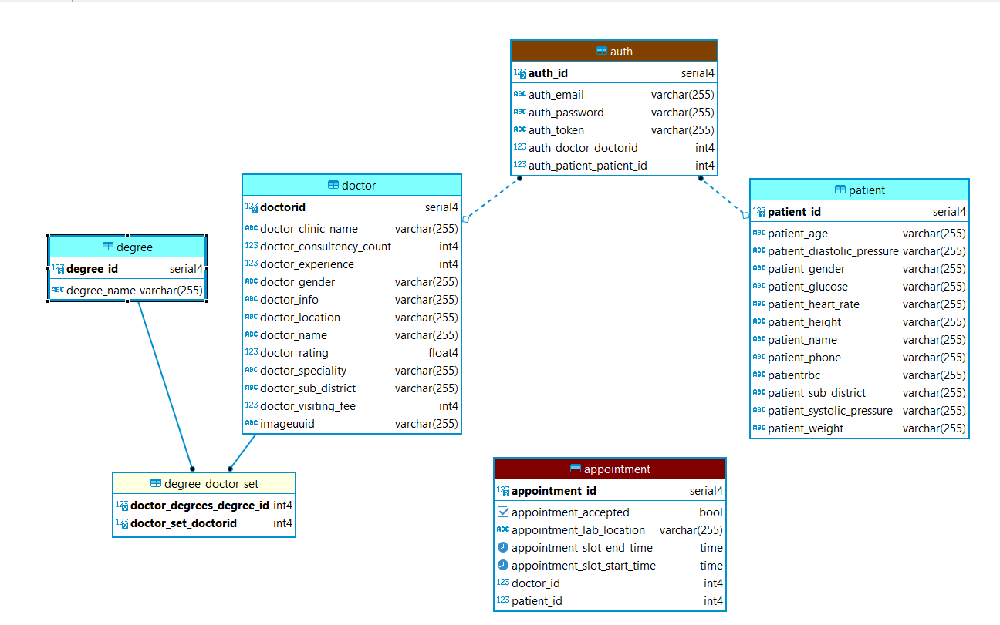

 

## DocLab-backend ! 
 >The REST API for the webapp Doclab.

#### Description:
This API provides access to the Postgresql `Database` to the front end of
frontend([DocLab-frontend](https://github.com/IIT-Project-Team/DocLab-frontend)) of this webapp.


### DocLab Backend

To run the backend server in your local machine follow these instructions on your terminal:

```bash
# Clone the repository
git clone https://github.com/jahidem/DocLab-backend.git
# Go into the project folder
cd DocLab-backend
# Run the app
mvn spring-boot:run
```

(open the url on your browser - http://localhost:8085)

Note: Java Jdk and Maven needs to be installed to run the backend server.

#### ER Diagram:
This is the ER diagram of the database for this spring boot application.


#### APIs:
###### For Auth
* GET request to `/auth` with TOKEN in header gives the particular row from auth table in Json format.

* POST request to `/auth/signup` with body `{
  "authEmail": "mail@email.com",
  "authPassword": "12345"
  }`
  creates this new auth and returns it.

* POST request to `/auth/login` with object `{
  "authEmail": "mail@email.com",
  "authPassword": "12345"
  }` generates a token and returns it.

###### For Doctor 
* GET request to `/doctor` provide the list of all available
 doctors at the moment in Json format.

* POST request to `/doctor/add` with `TOKEN` in header and doctor object (`{
  "doctorName": "",
  "doctorGender": "",
  "doctorSubDistrict": "",
  "doctorSpeciality": "",
  "doctorEmail": "",
  "doctorLocation": "",
  "doctorClinicName": ""
  }`)
  in body adds the doctor to the auth account having the given token in the header.

* DELETE request to `/doctor/delete` with `TOKEN` in header deletes if there's doctor attached to the auth account having the given token tn the header.

* PUT request to `/doctor/has/{degreeId}` with `TOKEN` in header add the particular degree having `degreeI`' to the doctor of the auth account having the `TOKEN` given in the header. 


###### For Patient
* GET request to `/patient` provide the list of all
  patients at the moment in Json format.

* POST request to `/patient/add` with `TOKEN` in header and patient object (`{
  "patientName" : "",
  "patientGender": "",
  "patientPhone" : "",
  "patientSubDistrict" : ""
}`)
  in body adds the patient to the auth account having the given token in the header.

* DELETE request to `/patient/delete` with `TOKEN` in header deletes if there's patient attached to the auth account having the given token tn the header.


###### For Appointment
* GET request to `/appointment` provide the list of all appointments at the moment in Json format.

* GET request to `/appointment/getByDoctor/{id}` gives info of the Appointments for a doctor
  having the `id` in Json format.


* GET request to `/appointment/getByPatient/{id}` gives info of the Appointments for a patient
  having the `id` in Json format.

* POST request to `/appointment/post` with body 
  `{
  "appointmentLabLocation": "Dhaka",
  "appointmentAccepted": true,
  "doctorId": 3,
  "patientId": 1,
  "appointmentSlotStartTime": "2022-12-11T11:40:49.000+00:00",
  "appointmentSlotEndTime" : "2022-12-11T11:40:49.000+00:00"
  }`
  add patient having id of `1` to the doctor having id of `3` for an appointment.

